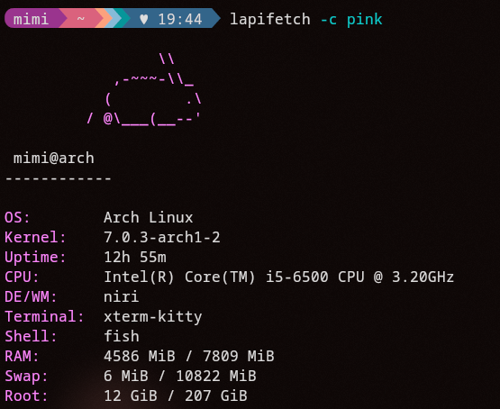
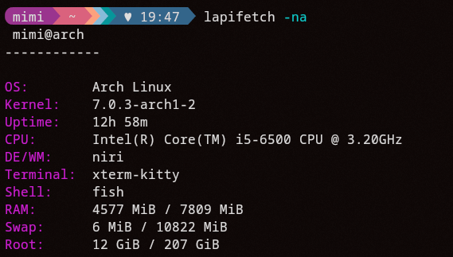
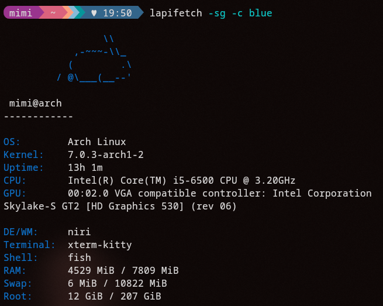

# lapifetch

lapifetch is a simple bunny-themed Linux fetch utility written in C++.

## Dependencies

All you need is a c++ compiler, like gcc.

## Build/Install

- Clone the repository and go to the directory:

```bash
$ git clone https://github.com/asunyan-dev/lapifetch

$ cd lapifetch
```

### Build

To build, simply run:

```bash
$ make
```

### Install

To install to the command, run:

```bash
$ sudo make install

$ make clean
```

- You need `sudo` permission to install, cause it will be copied to `/usr/local/bin`.
- `make clean` removes the building files that are unnecessary after the installation.

## Usage

For a basic usage, simply run:

```bash
$ lapifetch
```

If you want to see more information, for example to hide the bunny art, or to show GPU information, run:

```bash
$ lapifetch --help
```

This will show you all the information you need.

### Screenshots

Example of `lapifetch` with pink color:



Now `lapifetch` but without the bunny art:



And with GPU information + blue color



## Uninstall

To uninstall the command, go to the repo folder you've cloned and run:

```bash
$ sudo make uninstall
```

## Contact

If you have any bug, issue, or advice to give, always feel free to contact me on discord: `@lapinou112`.